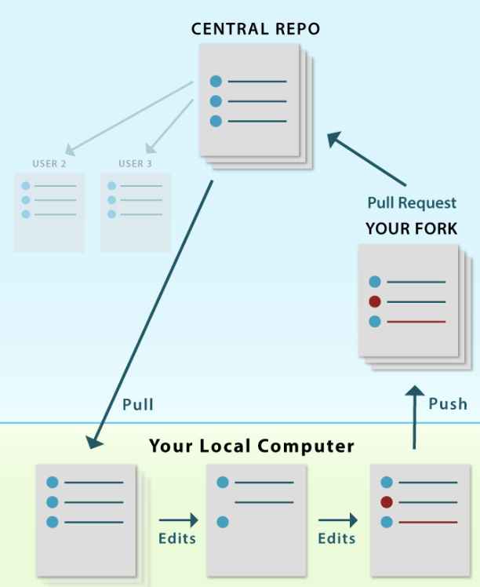
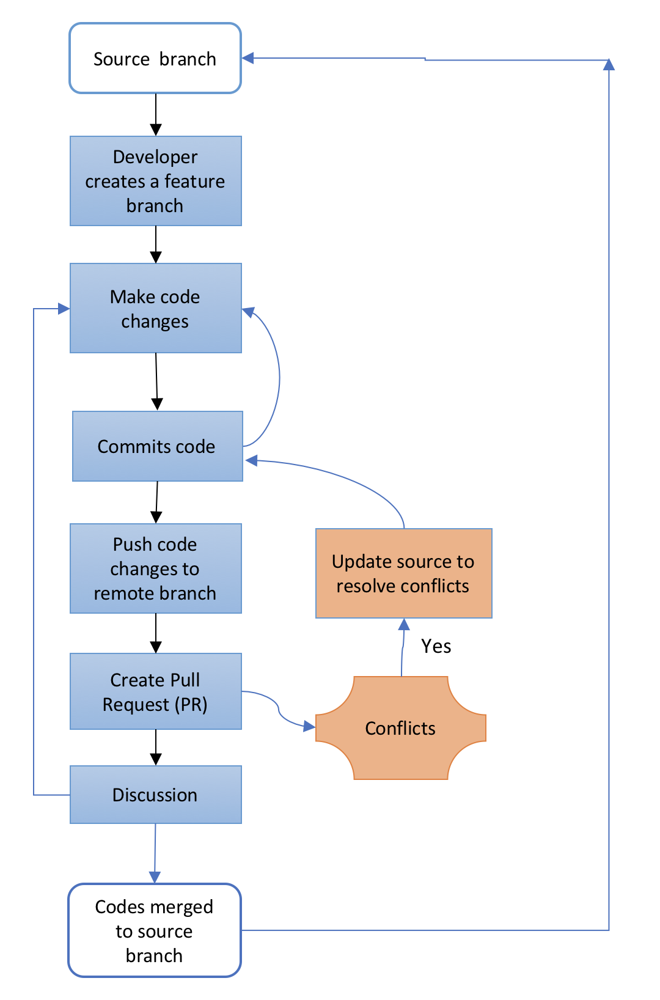

# What is a pull request?
A pull request is a development process used to provide a discussion and review of a completed feature.
The discussion usually helps improve the quality of the code and helps notify the other team members that 
the feature has been completed and it's open for discussion or modifications. 

>  Pull requests require two distinct branches. There needs to be a difference in the 
>  code between the taken branch and source branch in order to create a pull request.

Pull requests let you tell others about changes you've pushed to a branch in a repository on GitHub. Once a pull request is opened, you can discuss and review the potential changes with collaborators and add follow-up commits before your changes are merged into the base branch.

https://help.github.com/articles/about-pull-requests

## Prior to creating a pull request you must:
1. Rebase your branch to ensure any any new pull requests have been merged so your branch is current
2. Commit completed code in your feature branch. Note feature branch can have any number of commit
3. Push commited changes to the remote branch and merge if necessary
4. After rebasing, any conflicts that arise need to be resolved, and the code needs to be pushed back to the remote branch.
5. Finally, it’s time to create a pull request.

### Common Branches
**master branch:**  A pull request is created by  developer from the release branch to merge code to the master branch. Usually, the pull request is created during release time when the code is ready for deployment. The pull request is merged by the next-level person or the technical lead who created it.

## Writing a Good Commit Message

Let's review the anatomy of a commit message.

 

> **First line**, no more than 50 characters
 
> **Details section**, as long as you want. Not always necessary, but
> available if you need it. Wrapped at 72 characters. 

> - Use bullets if you need
> - Bullets are a good way to summarize a few things

## References
1. https://www.thinkful.com/learn/github-pull-request-tutorial/#Writing-a-Good-Commit-Message
2. https://blog.axosoft.com/pull-requests-gitflow/
